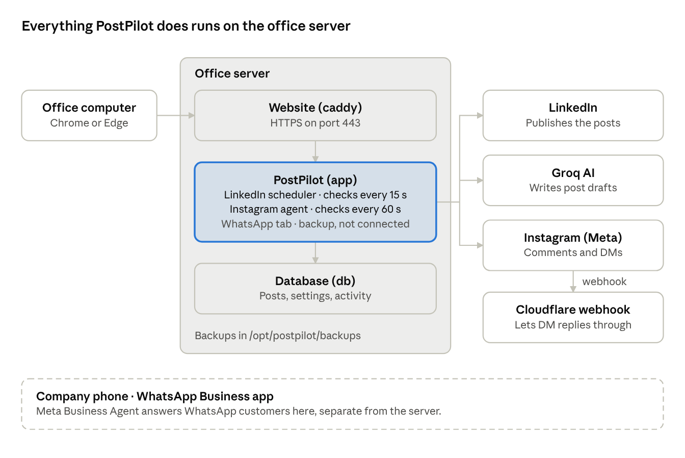

# PostPilot Team Handbook

Last updated: 8 October 2026. The editable copy is the Claude doc "PostPilot Team Handbook" (ask the admin for access). When one copy changes, update the other. Server address, logins, keys and account details are deliberately not in this file: get them from the admin or the office password manager.

PostPilot runs on the office server and works on its own: it publishes scheduled LinkedIn posts and answers Instagram comments. This handbook lets the office team use it, keep it running and fix common problems while the admin is away.

## At a glance



You only ever open the website. The website, the app and the database all run on the office server, which talks to LinkedIn, Instagram and Groq by itself. WhatsApp is handled on the company phone, not by the server.

## Before the admin leaves

The team can only run PostPilot if these are handed over before the leave starts. Keep the secret ones (access link, server login) in a password manager or a sealed envelope, never in this file, chat or email.

- [ ] **PostPilot access link** (`https://<server address>/#t=…`): the part after `#t=` is the access key. It is stored on the server in `/opt/postpilot/.env` as `POSTPILOT_TOKEN`.
- [ ] **Server login**: an SSH login for the server (folder `/opt/postpilot`) for at least one team member, tested once.
- [ ] **Where the server physically runs** and how to switch it on after a power cut (written in the private Claude doc).
- [ ] **Reconnect LinkedIn the day before leaving**: a LinkedIn login lasts 60 days, so this covers a long leave. Settings → LinkedIn account → Reconnect.
- [ ] **Queue posts** for the whole leave in the Queue, or agree who writes new ones.
- [ ] **Instagram token pasted** on the server (Instagram tab → Settings) and the automations created there.
- [ ] **Logins the team may need**: the LinkedIn account, the Meta developer account (for a new Instagram token), the Groq account (AI key), and the WhatsApp Business phone. See Accounts at the end.
- [ ] **One test run**: a team member opens the app, checks the three tabs and runs `docker compose -f docker-compose.server.yml ps` on the server with the admin watching.

## Opening PostPilot

Open the access link once in Chrome or Edge on an office computer; the browser remembers it, so afterwards `https://<server address>` is enough. If the browser warns about the security certificate, click **Advanced → Continue**: the server uses its own certificate.

Each agent opens in its own browser tab. The **Agents** section at the bottom of the left menu links to the others.

| Tab | What it does | What you do there |
| --- | --- |
| **LinkedIn** (Dashboard) | Publishes queued posts at the planned times; checks every 15 s | Write or AI-draft posts (Compose), plan them (Queue, Calendar), retry failed posts, pause or resume publishing |
| **Instagram agent** | Someone comments a keyword on a post and gets your link or PDF in their DMs; checks every minute | Create automations, read Activity, pause, paste a new token in Settings |
| **WhatsApp agent** | Backup only, not connected. WhatsApp is answered by **Meta Business Agent** inside the WhatsApp Business app on the company phone | Nothing, unless the admin decides to switch to it |

**WhatsApp today:** customer chats are answered by Meta's own AI agent in the WhatsApp Business app (included in the company's Meta One business plan). Its answers come from the app's **Knowledge** screen. Chats it can't handle go back to the people using the app. Do not connect the PostPilot WhatsApp tab while Meta's agent is on: two bots would answer the same customers.

**Every tab shows its status at the bottom left:** a green dot means running; orange means paused or not connected; red means it needs attention.

## Daily and weekly checks

Five minutes each morning catches almost every problem before it matters.

**Every day**

1. Open **LinkedIn → Dashboard**. The card should say **Agent running**, with a recent "Checked" time.
2. Look at **Needs attention**. If it isn't 0, open the Queue, read the reason under the post and use **Retry** (see Troubleshooting).
3. Check that **Up next** has posts for the coming days.
4. Open the **Instagram agent** tab. The status should be green, and **Activity** should show no red **Failed** rows.
5. On the WhatsApp Business phone, look for chats that Meta's agent handed back and answer them.

**Every week**

1. Read the banners on the LinkedIn Dashboard. **LinkedIn session expires in N days** means someone must reconnect (Settings → LinkedIn account → Reconnect) with the LinkedIn account's login.
2. In the Instagram tab, a banner **Instagram token expires in N days** means automatic renewal stopped working: paste a new token (Troubleshooting).
3. Check on the server that this week's backups exist (see Backups).

## Starting, stopping and restarting the server

PostPilot starts by itself whenever the server boots, so after a power cut you normally only switch the server on and wait 2–3 minutes. Everything else is done from a terminal on the server.

**1. Switch the server on.** Where it runs and how to power it on: see the private Claude doc (Accounts). Then check from any office computer: `https://<server address>/health` should load. If it shows an error, use the commands below.

**2. Log in to the server** from an office computer (Windows: PowerShell or Terminal):

```
ssh <user>@<server address>
cd /opt/postpilot
```

**3. The commands.** Run them inside `/opt/postpilot`. All of them use the same start, so it is written out in full each time.

| To do this | Run |
| --- | --- |
| See whether the three parts are running | `docker compose -f docker-compose.server.yml ps` |
| Start everything (after a stop or reboot) | `docker compose -f docker-compose.server.yml up -d` |
| Restart only the app (most fixes) | `docker compose -f docker-compose.server.yml restart app` |
| Read the app's recent messages (errors) | `docker compose -f docker-compose.server.yml logs app --tail 100` |
| Stop everything (before shutting the server down) | `docker compose -f docker-compose.server.yml stop` |
| Check free disk space | `df -h /` |

**What "running" looks like:** `ps` lists three parts, **db**, **app** and **caddy**, each with status **Up** (db and app also say **healthy**). db is the database, app is PostPilot, caddy serves the website.

**Shutting the server down safely:** run the stop command first, then `shutdown now`.

**Never run** `docker compose down -v` or delete Docker volumes: that erases every post, setting and login.

## Updating PostPilot and rolling back

Update only when the admin (or whoever maintains the code) says a new version is ready; nothing needs updating for PostPilot to keep working. One command does the whole update safely:

```
cd /opt/postpilot
./deploy.sh
```

It makes a backup, downloads the new version from GitHub, rebuilds the app and waits until it is healthy. Success ends with **Deployed &lt;old&gt; -> &lt;new&gt;. PostPilot is healthy.** Posts, settings and logins are kept.

**If it ends with "PostPilot did not become healthy"**, it prints the app's last messages and a rollback line such as `git checkout c7fec87 && docker compose -f docker-compose.server.yml up -d --build`. Run that exact line to go back to the version that worked, then tell the admin.

**Pending update:** the server runs version c7fec87 (8 October 2026). The next update adds the WhatsApp tab and the Agents menu; it changes nothing in how LinkedIn or Instagram work.

## Backups and restoring

Backups are two files per run in `/opt/postpilot/backups`: `db_<date>.dump` (posts, settings, activity) and `data_<date>.tgz` (images, PDFs and the saved logins and keys). Files older than 14 days are deleted automatically. Every update (`./deploy.sh`) makes one first.

| To do this | Run (inside `/opt/postpilot`) |
| --- | --- |
| Make a backup now | `./backup.sh` (ends with **backup ok**) |
| List the backups | `ls -lh backups` |
| Check the daily automatic backup is set up | `crontab -l` should show a line ending in `backup.sh` |

If `crontab -l` shows no backup line, run `crontab -e` and add: `30 3 * * * /opt/postpilot/backup.sh >> /opt/postpilot/backups/backup.log 2>&1` (a backup every night at 03:30).

The backups contain the LinkedIn login and API keys: copy them only to a safe, private place (for example an office USB drive kept locked away), never to email, WhatsApp or a shared drive.

**Restoring** (only when data was lost or damaged; pick the newest good date for `<ts>`, e.g. `2026-10-08_0330`):

```
cd /opt/postpilot
docker compose -f docker-compose.server.yml stop app
docker compose -f docker-compose.server.yml exec -T db pg_restore -U postpilot -d postpilot --clean --if-exists < backups/db_<ts>.dump
docker compose -f docker-compose.server.yml exec -T db psql -U postpilot -c "INSERT INTO settings VALUES ('agent_paused','true') ON CONFLICT (key) DO UPDATE SET value='true'"
docker compose -f docker-compose.server.yml run --rm --no-deps -T app sh -c 'tar xzf - -C /data' < backups/data_<ts>.tgz
docker compose -f docker-compose.server.yml start app
```

The fourth line pauses LinkedIn publishing, so nothing goes out by surprise. Open the Dashboard, check the posts and the LinkedIn status, then press **Resume**.

## Troubleshooting

First step for almost anything strange: restart the app (`docker compose -f docker-compose.server.yml restart app`), wait one minute and reload the page. Nothing is lost by a restart.

| Problem | Likely cause | Fix |
| --- | --- |
| The page won't open at all | Server off, or the app stopped | Open `https://<server address>/health`. Nothing loads: switch the server on. Error shown: log in and run the start command (Starting section) |
| Security or certificate warning | The server's own certificate | Normal: Advanced → Continue |
| "This page needs the app's session key" or a new computer | The browser doesn't have the access link | Open the full access link once (from the password manager) |
| Dashboard: **Agent not responding** | The app hung | Restart the app; if it repeats, read the logs command and send the last lines to the admin |
| Post **Failed**, reason mentions 401 or session expired | LinkedIn login expired (every 60 days) | Settings → LinkedIn account → Reconnect (needs the LinkedIn account's login), then **Retry** on the post |
| Post **Failed** with another 4xx reason | LinkedIn refused the content (image size or format, text) | Edit the post, then **Retry** |
| Post **Missed** | The server was off longer than 6 hours at post time | Schedule it again (Queue) |
| "AI API key was rejected" | Groq key revoked or expired | Create a key at console.groq.com/keys, paste it in Settings → AI writing, press **Test** |
| Instagram: **Instagram rejected the token** or **not connected** | Token revoked or expired | Meta developer site → the app → Instagram → API setup with Instagram login → Generate token; paste it in Instagram tab → Settings |
| Instagram: **Reply messages are not set up** | The free Cloudflare webhook is missing | Follow `cloudflare/README.md` in the PostPilot folder, then **Check now** |
| Instagram: "Link can't be shared" or another account warning | Instagram restricted the account | **Pause** the Instagram agent, open the Instagram app → Settings → Account Status, request a review; tell the admin. Don't keep retrying |
| Instagram: "Hourly limit reached" | Safety cap of 150 DMs an hour | Nothing to do: the rest go out next hour |
| People get the same DM twice | A second copy of PostPilot also holds the Instagram token | Disconnect Instagram on the other copy (the test PC must stay in demo mode) |
| Server disk almost full (`df -h /` above 90%) | Old images or backups | `docker image prune -f`; move old files out of `backups/`; ask the admin |
| WhatsApp: Meta's agent gives a wrong answer | Its Knowledge is missing or out of date | Business app → AI agent → Knowledge: correct the facts, then **Test your AI** |

If nothing here helps: pause the affected agent, write down the time and the exact message, run the logs command and send the output to the admin.

## Rules that keep the accounts safe

LinkedIn, Instagram and WhatsApp restrict accounts that look like spam; these rules keep PostPilot well inside their limits.

- **Only one copy of PostPilot may hold the real logins.** The office server is the real one. The copy on the admin's own PC is a test copy in demo mode: never paste a LinkedIn, Instagram or WhatsApp login there, or posts and DMs go out twice.
- **LinkedIn:** keep the built-in limits (Settings → Posting schedule: at most 2 posts a day, 3 hours apart). Never use tools that click on linkedin.com automatically.
- **Instagram:** the agent only messages people who commented a keyword, at most 150 an hour. Leave **Only for followers** off, or use it rarely: Instagram discourages trading content for follows. If Instagram shows any warning, pause the agent and request a review instead of retrying.
- **WhatsApp:** only answer people who wrote first. No mass promotional messages or broadcasts to people who didn't agree to receive them (the most common reason numbers get banned). Keep the AI agent's Knowledge correct, so it never promises wrong fees or dates.
- **Logins and keys** (access link, server login, tokens, backups) are never shared in chat, email or this file.

## Accounts

Which logins the team may need. Write who holds each one in the private Claude doc, never in this file: this repository is public on GitHub.

| What | Used for |
| --- | --- |
| Office server (address and SSH login) | Starting, updating, backups |
| Where the server physically runs and how to power it on | After a power cut |
| PostPilot access link | Opening the app |
| LinkedIn account that posts | Reconnect every 60 days |
| Meta developer account (PostPilot's Meta app) | New Instagram token |
| The Instagram account | Account warnings, reviews |
| WhatsApp Business phone and Meta One plan | Meta's AI agent, its Knowledge |
| Groq account (console.groq.com) | AI key for writing posts |
| Cloudflare account | Instagram reply webhook |
| GitHub (github.com/thedbadmin/postpilot) | The code that updates come from |

**More detail** for whoever maintains the code: [README.md](README.md) and [PROJECT_CONTEXT.md](PROJECT_CONTEXT.md) in this folder.
